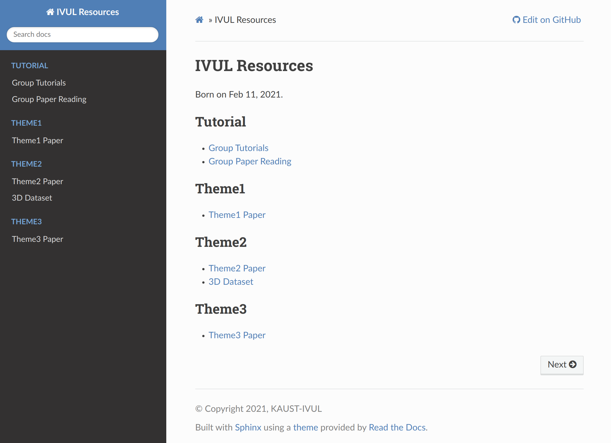
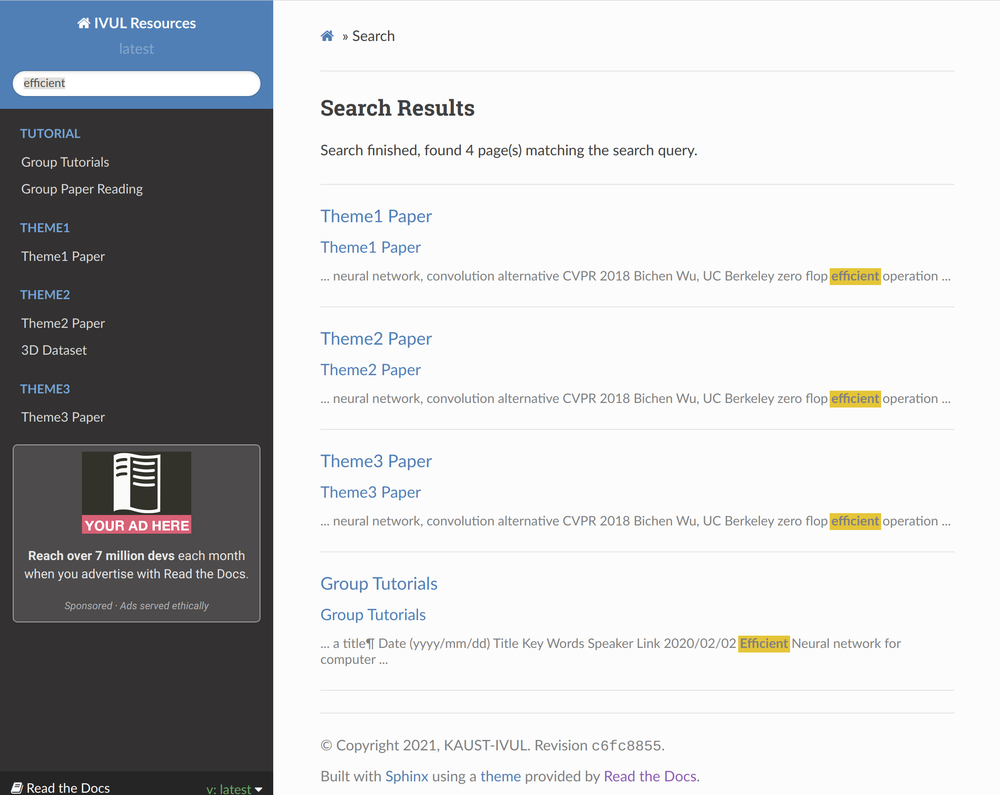

# IVUL-Resources: https://ivul_resources.readthedocs.io/en/latest/
Website: [ivul_resources](https://ivul_resources.readthedocs.io/en/latest/). 

IVUL Resources supports search:

## Structure 
Written in reST, support automatically HTML rendering in realtime by Sphinx. 

    docs
    ├── index.rst               # Index
    ├── conf.py                 # configuration file for Sphinx
    ├── content                 # 
        ├── Theme1              # Theme1 Resources
        │     ├── paper.rst     # suggested/Presented papers  
        │     ├── .rst  # 
        │
        ├── Theme2              # Theme2 Resources
        │     ├── dataset.rst   # dataset
        │     ├── paper.rst     # suggested/Presented papers  
        │    
        └── Theme3
              ├── paper.rst     # suggested/Presented papers  

    
## Contribute

1. fork this repo. Remember to update your forked repo (if you have forked before and have not updated to the latest version) . To update your forked repo, you have to: 1) ask for a pull request in your repo; 2) compare across forks; 3) merge from this repo to your repo. 

2. Modify or create a .rst file using reST language. [reST Documentation](https://thomas-cokelaer.info/tutorials/sphinx/rest_syntax.html).  

3. Ask for a [pull request](https://github.com/guochengqian/ivul_resources/pulls) in this repo.  

NOTE: Images can be put in docs/_static/image

